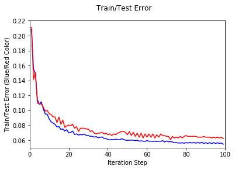
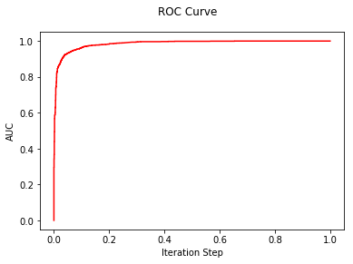
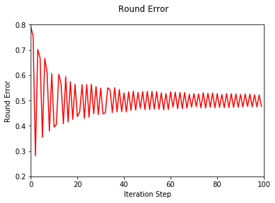

## AdaBoost Implementation

Implementation of AdaBoost with "optimal" decision stumps on the training data. After each round, the following gets computed:
1. Current training error for the weighted linear combination predictor at this round
2. Current testing error for the weighted linear combination predictor at this round
3. Current test AUC for the weighted linear combination predictor at this round
4. The local "round" error for the decision stump returned


```python
import math
import numpy as np
import pandas as pd
from sklearn import metrics
import matplotlib.pyplot as plt
```

### Implementing AdaBoost


```python
# AdaBoost
class AdaBoost:
    def __init__(self, iterations):
        self.train_df = None
        self.test_df = None
        self.train_labels = None
        self.test_labels = None
        self.train_predictions = None
        self.test_predictions = None
        self.thresholds_dict = None
        self.train_hx_dict = None
        self.columnname = None
        self.colsplitvalue = None
        self.epsilon = None
        self.alpha = None
        self.D = None
        self.trueClass = None
        self.falseClass = None
        self.train_H = None
        self.test_H = None
        self.iterations = iterations
        self.tr_err = None
        self.te_err = None
        self.rd_err = None
        self.fpr = None
        self.tpr = None
        
    # MainAlgo to fit the model
    def fit(self, train_X, train_y, test_X, test_y):
        self.train_df = train_X
        self.test_df = test_X
        self.train_labels = train_y[0].values
        self.test_labels = test_y[0].values
        self.train_H = np.zeros(shape = [1, len(train_X)], dtype = float)
        self.test_H = np.zeros(shape = [1, len(test_X)], dtype = float)
        
        self.initializeWeights(self.train_df)
        self.calc_thresholds()
        self.calc_hx()
        self.tr_err = []
        self.te_err = []
        self.rd_err = []
        for i in range(0, self.iterations):
            self.bestDecisionStump()
            train_err = self.calc_error(self.train_labels, self.train_H[0])
            test_err = self.calc_error(self.test_labels, self.test_H[0])
            self.tr_err.append(train_err)
            self.te_err.append(test_err)
            self.rd_err.append(self.epsilon)
            self.fpr, self.tpr, thresholds = metrics.roc_curve(self.train_labels, self.train_H[0])
            auc = np.trapz(self.tpr, self.fpr)
            #print("Round:", i+1, "Feature:", self.columnname, "Threshold:", self.colsplitvalue, "Round_err:", self.epsilon, "Train_err:", train_err, "Test_err:", test_err, "AUC:", auc)
            print("Round:", i+1)
            print("Train_err:", train_err, "Test_err:", test_err, "AUC:", auc)
            self.updateWeights()
    
    # Initialize weights
    def initializeWeights(self, train):
        self.D = np.ones(shape = [1,len(train)], dtype = float)*1/len(train)
        
    # Update weights
    def updateWeights(self):
        D_old = self.D
        alpha = self.alpha
        labels = self.train_labels
        predictions = [self.train_predictions]
        
        D_new = D_old * np.exp(-alpha * labels * predictions)
        Z = np.sum(D_new)
        
        D_norm = D_new / Z
        
        self.D = D_norm
    
    # Compute all threshold values
    def calc_thresholds(self):
        df = self.train_df
        thresholds = dict()
        
        for column in range(self.train_df.shape[1]):
            values = df[column].values.tolist()
            values.sort()
            
            uniq_values = list(set(values))
            tmp_thresholds = []

            for i in range(len(uniq_values)-1):
                if i%50==0:
                    tmp_thresholds.append((uniq_values[i]+uniq_values[i+1])/2)
                
            thresholds[column] = tmp_thresholds

        self.thresholds_dict = thresholds
    
    # Compute predictions for all threshold values        
    def calc_hx(self):
        df = self.train_df
        thresholds_dict = self.thresholds_dict
        train_hx = dict()
        
        for column in thresholds_dict:
            threshold = thresholds_dict[column]
            tmp = []

            for val in threshold:
                newdf1 = df.loc[df[column]<val]

                x1 = newdf1.loc[newdf1[0] == -1].count()[0]
                x2 = newdf1.loc[newdf1[0] == +1].count()[0]
                    
                if x1 > x2:
                    pr = [-1, 1]
                else:
                    pr = [1, -1]

                prediction = self.predict(df, column, val, pr)
                tmp.append([val, pr, prediction])
                
            train_hx[column] = tmp

        self.train_hx_dict = train_hx

    # Find the best predictor on which split needs to take place
    def bestDecisionStump(self):
        train_hx_dict = self.train_hx_dict
        
        bestepsilon = 0.0
        maxdiff = 0.0
        
        for column in train_hx_dict:
            threshold = train_hx_dict[column]
            
            for val in threshold:
                epsilon = self.calc_epsilon(self.D[0], self.train_labels, val[2])
                diff = abs(0.5 - epsilon)
                
                if diff > maxdiff:
                    maxdiff = diff
                    bestepsilon = epsilon
                    splitval = val[0]
                    splitcolumn = column
                    bestpred = val[2]
                    bestpr = val[1]
            
        self.columnname = splitcolumn
        self.colsplitvalue = splitval
        self.epsilon = bestepsilon
        self.alpha = math.log((1-bestepsilon)/bestepsilon)/2
        self.train_predictions = bestpred
        self.test_predictions = self.predict(self.test_df, self.columnname, self.colsplitvalue, bestpr)
        self.trueClass = bestpr[0]
        self.falseClass = bestpr[1]
        self.train_H = self.train_H + self.calc_Hx(self.alpha, self.train_predictions)
        self.test_H = self.test_H + self.calc_Hx(self.alpha, self.test_predictions)
        
    # Function to make prediction for a single row
    def predictRow(self, row, columnname, colsplitvalue, pr):
        col = columnname
        val = colsplitvalue
        global pred
        if row[col].values[0] < val:
            pred = pr[0]
        else:
            pred = pr[1]
            
        return pred
  
    # Function to make predictions for the entire dataset
    def predict(self, df, columnname, colsplitvalue, pr):
        prediction = []
        
        for i in range(len(df)):
            prediction.append(self.predictRow(df.iloc[[i]], columnname, colsplitvalue, pr))
        
        return prediction
        
    # Calculate epsilon to modify weights
    def calc_epsilon(self, D, actual, predictions):
        epsilon = 0
        for i in range(len(actual)):
            if actual[i] != predictions[i]:
                epsilon+=D[i]
         
        return epsilon

    # Calculate error
    def calc_error(self, actual, predictions):
        matchcount = 0
        for i in range(len(actual)):
            if (actual[i] > 0 and predictions[i] > 0) or (actual[i] < 0 and predictions[i] < 0):
                matchcount+=1
        
        return (1 - matchcount/len(actual))
    
    # Calculate Hx
    def calc_Hx(self, alpha, predictions):
        Hx = alpha * np.array(predictions)
        
        return Hx
        
    # Plot Train/Test Error
    def plot_train_test_error(self):
        plt.suptitle('Train/Test Error')
        plt.xlabel('Iteration Step'), plt.ylabel('Train/Test Error (Blue/Red Color)')
        plt.xlim(0, self.iterations), plt.ylim(0.05,.22)
        x = list(range(0, self.iterations))
        plt.plot(x, self.tr_err, color = "blue")
        plt.plot(x, self.te_err, color = "red")
        plt.show()
        
    # Plot ROC Curve
    def plot_ROC_curve(self):
        plt.suptitle('ROC Curve')
        plt.xlabel('Iteration Step'), plt.ylabel('AUC')
        plt.plot(self.fpr, self.tpr, color = "red")
        plt.show()
        
    # Plot Round Error
    def plot_round_error(self):
        plt.suptitle('Round Error')
        x = list(range(0, self.iterations))
        plt.xlabel('Iteration Step'), plt.ylabel('Round Error')
        plt.xlim(0, self.iterations), plt.ylim(0.2,.8)
        plt.plot(x, self.rd_err, color = "red")
        plt.show()
```

### Splitting the spambase dataset into train and test


```python
# Load the entire dataset into a dataframe and split into train and test
def splitTrainTest(filename):
    df = pd.read_csv(filename, sep = ',', header = None)
    
    n = df.shape[1] - 1
    updlabel = df[n].values
    for i in range(len(updlabel)):
        if updlabel[i] == 0:
            updlabel[i] = -1

    df[n] = updlabel

    train_X = pd.DataFrame()
    train_y = pd.DataFrame()
    test_X = pd.DataFrame()
    test_y = pd.DataFrame()
    
    for i in range(len(df)):
        if i%5 != 0:
            train_X = pd.concat([train_X, df.iloc[[i]]])
            train_y = pd.concat([train_y, df.iloc[[i]][n]])
        else:
            test_X = pd.concat([test_X, df.iloc[[i]]])
            test_y = pd.concat([test_y, df.iloc[[i]][n]])
    
    del train_X[n]
    del test_X[n]

    return (train_X, train_y, test_X, test_y)
```

### Processing spambase dataset


```python
filename = "data/Spambase dataset/spambase.data"
train_X, train_y, test_X, test_y = splitTrainTest(filename)
```

### Running AdaBoost and printing the train and test error after each iteration


```python
model = AdaBoost(iterations = 100)
model.fit(train_X, train_y, test_X, test_y)
```

    Round: 1
    Train_err: 0.20760869565217388 Test_err: 0.21064060803474483 AUC: 0.748974795114
    Round: 2
    Train_err: 0.20760869565217388 Test_err: 0.21064060803474483 AUC: 0.86398716561
    Round: 3
    Train_err: 0.1554347826086957 Test_err: 0.14115092290988052 AUC: 0.898498685635
    Round: 4
    Train_err: 0.1483695652173913 Test_err: 0.15092290988056456 AUC: 0.92024137931
    Round: 5
    Train_err: 0.11413043478260865 Test_err: 0.10966340933767649 AUC: 0.939361218494
    Round: 6
    Train_err: 0.10815217391304344 Test_err: 0.10857763300760048 AUC: 0.946276480594
    Round: 7
    Train_err: 0.11141304347826086 Test_err: 0.10857763300760048 AUC: 0.953946961497
    Round: 8
    Train_err: 0.10217391304347823 Test_err: 0.10423452768729646 AUC: 0.95935302304
    Round: 9
    Train_err: 0.09510869565217395 Test_err: 0.09880564603691644 AUC: 0.962324261636
    Round: 10
    Train_err: 0.09483695652173918 Test_err: 0.09989142236699244 AUC: 0.964139786609
    Round: 11
    Train_err: 0.08858695652173909 Test_err: 0.09554831704668842 AUC: 0.966628575847
    Round: 12
    Train_err: 0.08451086956521736 Test_err: 0.09446254071661242 AUC: 0.968942167929
    Round: 13
    Train_err: 0.08288043478260865 Test_err: 0.0912052117263844 AUC: 0.970139477347
    Round: 14
    Train_err: 0.08125000000000004 Test_err: 0.0912052117263844 AUC: 0.970950672646
    Round: 15
    Train_err: 0.07771739130434785 Test_err: 0.08360477741585237 AUC: 0.972145971857
    Round: 16
    Train_err: 0.07826086956521738 Test_err: 0.0912052117263844 AUC: 0.972852172568
    Round: 17
    Train_err: 0.07445652173913042 Test_err: 0.08143322475570036 AUC: 0.974334931189
    Round: 18
    Train_err: 0.07499999999999996 Test_err: 0.08686210640608039 AUC: 0.974685170867
    Round: 19
    Train_err: 0.07228260869565217 Test_err: 0.07709011943539634 AUC: 0.975599969074
    Round: 20
    Train_err: 0.07418478260869565 Test_err: 0.07926167209554835 AUC: 0.976062161744
    Round: 21
    Train_err: 0.06983695652173916 Test_err: 0.08034744842562436 AUC: 0.976950672646
    Round: 22
    Train_err: 0.07038043478260869 Test_err: 0.07926167209554835 AUC: 0.977355497139
    Round: 23
    Train_err: 0.07228260869565217 Test_err: 0.08143322475570036 AUC: 0.977557754755
    Round: 24
    Train_err: 0.06766304347826091 Test_err: 0.07600434310532034 AUC: 0.978207515077
    Round: 25
    Train_err: 0.06847826086956521 Test_err: 0.07817589576547235 AUC: 0.978347147054
    Round: 26
    Train_err: 0.0668478260869565 Test_err: 0.07166123778501632 AUC: 0.97869197464
    Round: 27
    Train_err: 0.06766304347826091 Test_err: 0.07600434310532034 AUC: 0.978842430803
    Round: 28
    Train_err: 0.06711956521739126 Test_err: 0.07600434310532034 AUC: 0.979023040049
    Round: 29
    Train_err: 0.06820652173913044 Test_err: 0.07600434310532034 AUC: 0.979199783516
    Round: 30
    Train_err: 0.06630434782608696 Test_err: 0.07491856677524433 AUC: 0.979619761868
    Round: 31
    Train_err: 0.06630434782608696 Test_err: 0.07491856677524433 AUC: 0.979657955775
    Round: 32
    Train_err: 0.06521739130434778 Test_err: 0.07166123778501632 AUC: 0.979851244781
    Round: 33
    Train_err: 0.06521739130434778 Test_err: 0.07274701411509232 AUC: 0.980280191743
    Round: 34
    Train_err: 0.06413043478260871 Test_err: 0.06948968512486431 AUC: 0.980561620535
    Round: 35
    Train_err: 0.06494565217391302 Test_err: 0.0684039087947883 AUC: 0.980766042987
    Round: 36
    Train_err: 0.0633152173913043 Test_err: 0.06948968512486431 AUC: 0.980952218958
    Round: 37
    Train_err: 0.06385869565217395 Test_err: 0.06948968512486431 AUC: 0.981040049482
    Round: 38
    Train_err: 0.06440217391304348 Test_err: 0.07057546145494031 AUC: 0.981159734034
    Round: 39
    Train_err: 0.0625 Test_err: 0.0684039087947883 AUC: 0.981244317303
    Round: 40
    Train_err: 0.061956521739130466 Test_err: 0.06948968512486431 AUC: 0.981402505026
    Round: 41
    Train_err: 0.06114130434782605 Test_err: 0.0673181324647123 AUC: 0.981488170713
    Round: 42
    Train_err: 0.06032608695652175 Test_err: 0.0684039087947883 AUC: 0.981622390598
    Round: 43
    Train_err: 0.06114130434782605 Test_err: 0.0662323561346363 AUC: 0.981677593938
    Round: 44
    Train_err: 0.06059782608695652 Test_err: 0.0684039087947883 AUC: 0.981735426009
    Round: 45
    Train_err: 0.06141304347826082 Test_err: 0.0673181324647123 AUC: 0.98181768981
    Round: 46
    Train_err: 0.060869565217391286 Test_err: 0.06948968512486431 AUC: 0.982018246482
    Round: 47
    Train_err: 0.06059782608695652 Test_err: 0.07057546145494031 AUC: 0.982032163291
    Round: 48
    Train_err: 0.061956521739130466 Test_err: 0.07166123778501632 AUC: 0.98215153858
    Round: 49
    Train_err: 0.06114130434782605 Test_err: 0.07166123778501632 AUC: 0.982280191743
    Round: 50
    Train_err: 0.060054347826086985 Test_err: 0.07057546145494031 AUC: 0.982347610948
    Round: 51
    Train_err: 0.05978260869565222 Test_err: 0.0673181324647123 AUC: 0.982419514458
    Round: 52
    Train_err: 0.060054347826086985 Test_err: 0.07166123778501632 AUC: 0.982599041287
    Round: 53
    Train_err: 0.060054347826086985 Test_err: 0.0662323561346363 AUC: 0.982757538271
    Round: 54
    Train_err: 0.060054347826086985 Test_err: 0.07057546145494031 AUC: 0.982773929179
    Round: 55
    Train_err: 0.05951086956521734 Test_err: 0.06514657980456029 AUC: 0.982777021803
    Round: 56
    Train_err: 0.060054347826086985 Test_err: 0.06948968512486431 AUC: 0.982916808412
    Round: 57
    Train_err: 0.05869565217391304 Test_err: 0.06406080347448428 AUC: 0.98297433122
    Round: 58
    Train_err: 0.05923913043478257 Test_err: 0.06948968512486431 AUC: 0.983121849389
    Round: 59
    Train_err: 0.05869565217391304 Test_err: 0.06297502714440828 AUC: 0.983144734807
    Round: 60
    Train_err: 0.05842391304347827 Test_err: 0.0684039087947883 AUC: 0.983240606154
    Round: 61
    Train_err: 0.05951086956521734 Test_err: 0.06406080347448428 AUC: 0.983351631359
    Round: 62
    Train_err: 0.05869565217391304 Test_err: 0.0684039087947883 AUC: 0.983399876295
    Round: 63
    Train_err: 0.05869565217391304 Test_err: 0.06406080347448428 AUC: 0.983416267203
    Round: 64
    Train_err: 0.05842391304347827 Test_err: 0.0684039087947883 AUC: 0.983541827741
    Round: 65
    Train_err: 0.05869565217391304 Test_err: 0.06297502714440828 AUC: 0.983584196691
    Round: 66
    Train_err: 0.0581521739130435 Test_err: 0.0673181324647123 AUC: 0.983716561002
    Round: 67
    Train_err: 0.05869565217391304 Test_err: 0.06406080347448428 AUC: 0.983738827895
    Round: 68
    Train_err: 0.05842391304347827 Test_err: 0.0684039087947883 AUC: 0.983834699242
    Round: 69
    Train_err: 0.05951086956521734 Test_err: 0.0662323561346363 AUC: 0.983870419051
    Round: 70
    Train_err: 0.05760869565217386 Test_err: 0.0662323561346363 AUC: 0.983969537653
    Round: 71
    Train_err: 0.058967391304347805 Test_err: 0.06514657980456029 AUC: 0.983947889284
    Round: 72
    Train_err: 0.057880434782608736 Test_err: 0.06514657980456029 AUC: 0.984031080872
    Round: 73
    Train_err: 0.0581521739130435 Test_err: 0.06080347448425627 AUC: 0.984115664141
    Round: 74
    Train_err: 0.05760869565217386 Test_err: 0.06514657980456029 AUC: 0.984151847843
    Round: 75
    Train_err: 0.056793478260869557 Test_err: 0.06297502714440828 AUC: 0.984188340807
    Round: 76
    Train_err: 0.056793478260869557 Test_err: 0.06406080347448428 AUC: 0.984260089686
    Round: 77
    Train_err: 0.05625000000000002 Test_err: 0.06297502714440828 AUC: 0.984386578011
    Round: 78
    Train_err: 0.05625000000000002 Test_err: 0.06514657980456029 AUC: 0.984457089841
    Round: 79
    Train_err: 0.05652173913043479 Test_err: 0.06297502714440828 AUC: 0.984476573373
    Round: 80
    Train_err: 0.055978260869565255 Test_err: 0.06514657980456029 AUC: 0.984548631514
    Round: 81
    Train_err: 0.056793478260869557 Test_err: 0.0662323561346363 AUC: 0.984567032627
    Round: 82
    Train_err: 0.05625000000000002 Test_err: 0.06514657980456029 AUC: 0.984602288542
    Round: 83
    Train_err: 0.057065217391304324 Test_err: 0.06514657980456029 AUC: 0.984614968301
    Round: 84
    Train_err: 0.05625000000000002 Test_err: 0.06514657980456029 AUC: 0.984681768981
    Round: 85
    Train_err: 0.057065217391304324 Test_err: 0.06514657980456029 AUC: 0.98471114891
    Round: 86
    Train_err: 0.055978260869565255 Test_err: 0.06514657980456029 AUC: 0.984777794959
    Round: 87
    Train_err: 0.057065217391304324 Test_err: 0.06406080347448428 AUC: 0.98479202103
    Round: 88
    Train_err: 0.055978260869565255 Test_err: 0.06406080347448428 AUC: 0.984805628576
    Round: 89
    Train_err: 0.05733695652173909 Test_err: 0.06406080347448428 AUC: 0.984824493583
    Round: 90
    Train_err: 0.05543478260869561 Test_err: 0.06514657980456029 AUC: 0.984867171795
    Round: 91
    Train_err: 0.056793478260869557 Test_err: 0.06406080347448428 AUC: 0.984914488944
    Round: 92
    Train_err: 0.05543478260869561 Test_err: 0.06406080347448428 AUC: 0.984970774702
    Round: 93
    Train_err: 0.056793478260869557 Test_err: 0.06406080347448428 AUC: 0.984970156178
    Round: 94
    Train_err: 0.05543478260869561 Test_err: 0.06297502714440828 AUC: 0.985027988248
    Round: 95
    Train_err: 0.056793478260869557 Test_err: 0.06406080347448428 AUC: 0.985052729241
    Round: 96
    Train_err: 0.05570652173913049 Test_err: 0.06297502714440828 AUC: 0.985028916035
    Round: 97
    Train_err: 0.05652173913043479 Test_err: 0.06406080347448428 AUC: 0.985054584815
    Round: 98
    Train_err: 0.05570652173913049 Test_err: 0.06297502714440828 AUC: 0.985129426318
    Round: 99
    Train_err: 0.05625000000000002 Test_err: 0.06406080347448428 AUC: 0.985206741921
    Round: 100
    Train_err: 0.05461956521739131 Test_err: 0.061889250814332275 AUC: 0.985246946034
    

### Plot of train and test error versus number of iterations


```python
model.plot_train_test_error()
```





### Plot of final ROC curve


```python
model.plot_ROC_curve()
```





### Plot of local round error which reduces after each iteration


```python
model.plot_round_error()
```




